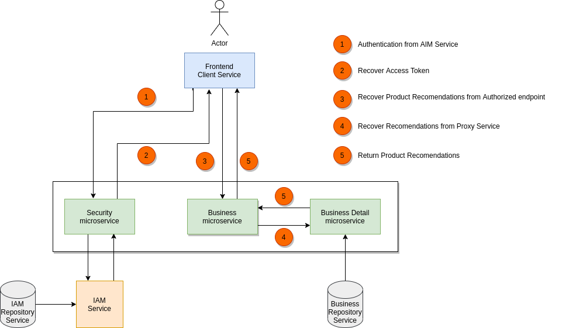
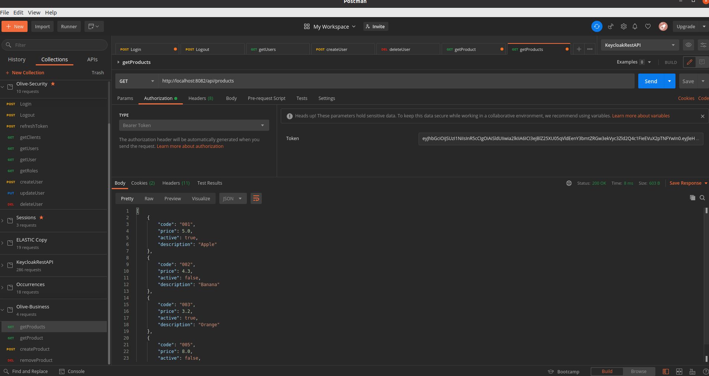
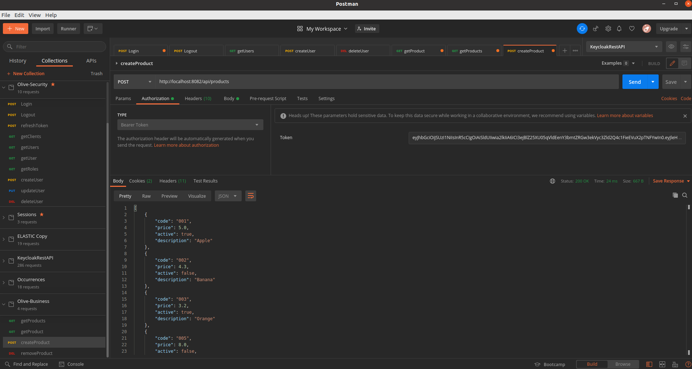

# Description
Poc Keycloak Business SpringBoot Microservice

## The Architecture of the business PoC

This diagram showes a business microservices PoC Architecture integrated with an IAM service using a **Outh2/ OpenID** implementation and **role-based access control (RBAC)** approach to restricting system access to authorized users:

- Implement **Outh2/ OpenID** and **IAM Admin API**: users, roles, groups and clients entities from **RedHat Keycloak**

- Implement **RBAC** from **Spring Boot Security**

## Test Get products from realm with Postman
This endpoint it's securized with **access token** and **admin, operator**, **user** roles

## Test Create product from realm with Postman
This endpoint it's securized with **access token** and **admin, operator** roles

