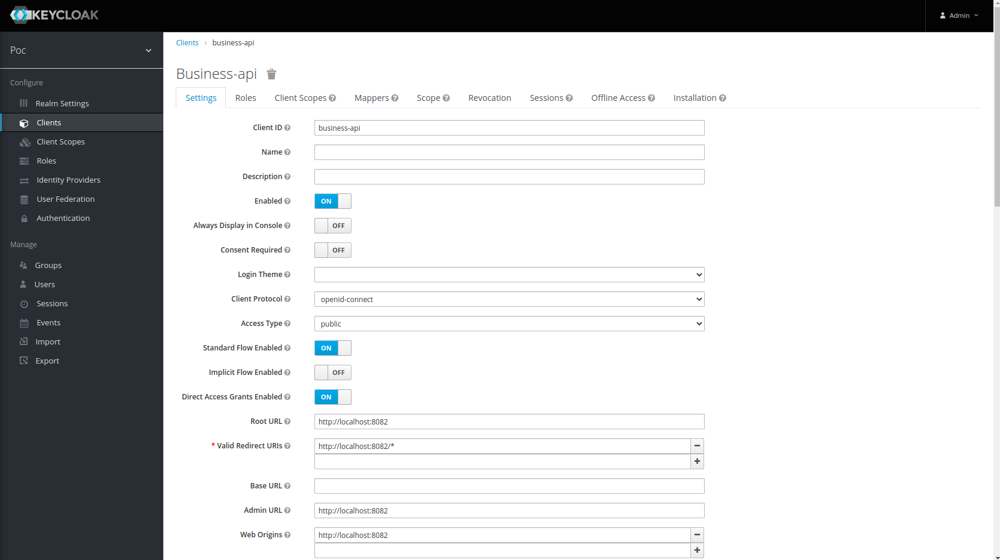
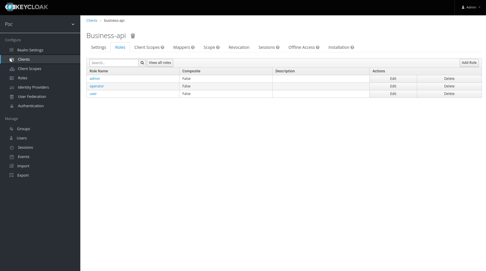
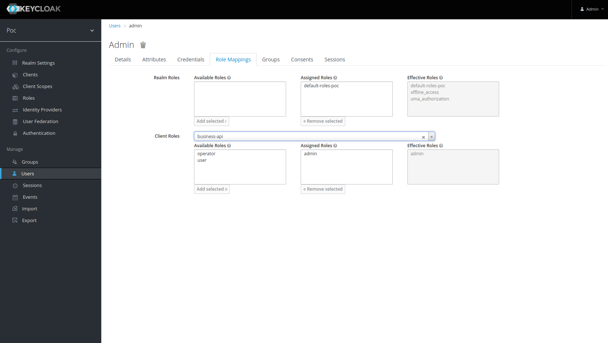

# Description
Poc Keycloak Authentication/Authorization SpringBoot Microservice

# Keycloak resources: realm, client, roles and users

## Create client

- **Name**: business-api
- **Root URL**: http://localhost:8082 (This is the domain where microservice is running)

## Create client roles
Inside the client we created these roles:

- **name**: admin, operator, user

## Add users roles for business client
- **name**: admin with roles: **admin** in **business-api** client
- **name**: operator with role: **operator** in **business-api** client
- **name**: user with role: **user** in **business-api** client

## Test Get products from realm with Postman
This endpoint it's securized with **access token** and **admin, operator**, **user** roles

## Test Create product from realm with Postman
This endpoint it's securized with **access token** and **admin, operator** roles

